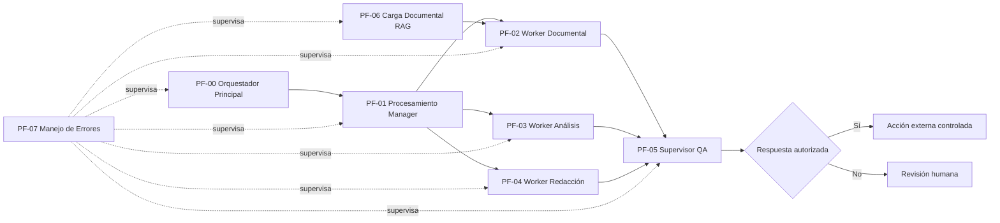

# Asistente para la Gestión de Reclamos de Calidad

Proyecto final de automatización con IA orientado a la gestión supervisada de reclamos de calidad en un contexto logístico.

La solución fue desarrollada en **n8n** bajo una arquitectura **Manager–Worker**, con uso de **RAG**, **AI-as-a-Judge**, **Human-in-the-Loop (HITL)**, **idempotencia**, **trazabilidad** y **manejo centralizado de errores**.

> Este repositorio contiene una versión sanitizada y reproducible del proyecto. No incluye credenciales, secretos, documentación empresarial real ni datos personales.


## Objetivo

Reducir el tiempo operativo dedicado a la recepción, clasificación, análisis inicial y preparación de respuestas asociadas a reclamos de calidad, manteniendo supervisión humana antes de ejecutar acciones externas sensibles.

El sistema busca:

- recibir solicitudes de forma asíncrona;
- evitar registros duplicados;
- clasificar cada solicitud según su necesidad;
- derivarla al especialista correspondiente;
- consultar documentación mediante RAG cuando corresponde;
- evaluar la calidad de las respuestas con un AI Judge;
- aplicar un reintento automático controlado ante respuestas corregibles;
- escalar a revisión humana los casos de baja confianza o alto riesgo;
- mantener trazabilidad mediante `traceId` y `requestId`;
- detectar fallas técnicas y alertar al equipo.


## Arquitectura general




## Workflows

### PF-00 — Orquestador Principal

Punto de entrada del sistema.

Responsabilidades principales:

- recibe solicitudes mediante Webhook;
- genera `traceId`;
- valida campos obligatorios;
- verifica si el `requestId` ya fue procesado;
- evita duplicados;
- registra solicitudes pendientes;
- responde HTTP `202` para desacoplar recepción y procesamiento;
- ejecuta el Manager en segundo plano.

La idempotencia se implementa mediante búsqueda previa del `requestId` en Airtable.


### PF-01 — Procesamiento Manager

Clasifica la solicitud y selecciona un único especialista.

Rutas disponibles:

- `CONSULTAR_DOCUMENTACION`
- `ANALIZAR_RECLAMO`
- `REDACTAR_COMUNICACION`

El Manager utiliza un modelo LLM y salida estructurada para decidir la ruta. Luego ejecuta el Worker correspondiente y deriva la salida al Supervisor QA.


### PF-02 — Worker Documental

Especialista RAG.

Su función es responder consultas documentales utilizando exclusivamente información recuperada desde el almacén vectorial.

Características:

- consulta obligatoria a la herramienta RAG;
- hasta tres búsquedas por consulta;
- no utiliza conocimiento externo como sustituto de evidencia;
- cita únicamente metadatos realmente recuperados;
- responde exactamente `No sé` cuando no existe respaldo documental suficiente;
- devuelve contexto verificable al Supervisor QA.

En la versión pública se utiliza la referencia genérica **Cliente Demo** para evitar exponer documentación empresarial real.


### PF-03 — Worker Análisis de Reclamos

Realiza el análisis inicial del reclamo.

Identifica:

- resumen del incidente;
- información disponible;
- datos faltantes;
- documentación pendiente;
- próximos pasos sugeridos;
- puntos que requieren evaluación humana.

No atribuye responsabilidades ni toma decisiones finales sobre pagos, seguros o cierre del reclamo.


### PF-04 — Worker Redacción

Genera borradores de comunicaciones profesionales vinculadas al reclamo.

El Worker:

- utiliza exclusivamente la información recibida;
- no inventa datos;
- solicita información faltante cuando corresponde;
- no promete compensaciones ni resoluciones;
- no ejecuta el envío;
- entrega un borrador pendiente de supervisión.


### PF-05 — Supervisor QA

Es la capa de gobernanza principal del sistema.

Evalúa cada respuesta mediante un **AI-as-a-Judge** con una escala de exactitud factual de 1 a 5.

Reglas de decisión:

| Puntaje | Veredicto | Acción |
|---|---|---|
| 4–5 | `ACEPTADO` | Puede continuar |
| 3 | `CORREGIR` | Reintento automático único |
| 1–2 | `RECHAZADO` | Escalamiento a revisión humana |

#### Reintento automático

Cuando el resultado es `CORREGIR`, el sistema genera una nueva respuesta utilizando el feedback del Judge y vuelve a evaluarla.

El reintento ocurre una sola vez para evitar ciclos infinitos.

#### Human-in-the-Loop

Cuando la respuesta no puede autorizarse automáticamente, el flujo se bloquea y solicita una decisión humana.

Las opciones de revisión permiten:

- aprobar;
- derivar a edición.

La decisión humana queda registrada como evidencia de auditoría.


### PF-06 — Carga Documental RAG

Permite cargar documentos `.pdf` o `.docx` y generar embeddings para el Worker Documental.

La versión de demostración utiliza un vector store en memoria.

> Limitación conocida: al utilizar almacenamiento vectorial en memoria, el contenido debe volver a indexarse si la instancia de n8n se reinicia. En una implementación productiva se recomienda utilizar una base vectorial persistente.

La documentación empresarial real utilizada durante el desarrollo no está incluida en este repositorio.


### PF-07 — Manejo de Errores

Workflow centralizado de alertas técnicas.

Ante una ejecución fallida, captura:

- workflow afectado;
- ID de ejecución;
- último nodo ejecutado;
- modo de ejecución;
- mensaje del error;
- fecha del incidente.

Luego envía una alerta al canal humano configurado.

PF-00 a PF-06 utilizan PF-07 como `Error Workflow`.


## Idempotencia

El sistema utiliza `requestId` como clave de control.

Antes de registrar una nueva solicitud, PF-00 busca si existe un registro previo con el mismo identificador.

Si ya existe:

- no crea un segundo registro;
- no ejecuta nuevamente el Manager;
- no repite la acción externa;
- devuelve una respuesta indicando que la solicitud ya había sido recibida.

Este comportamiento fue validado mediante una prueba controlada con el mismo `requestId` enviado dos veces.


## Trazabilidad y memoria

Se utilizan dos identificadores principales:

- `requestId`: identifica la solicitud de negocio;
- `traceId`: identifica la ejecución técnica.

La persistencia operativa y de auditoría se realiza mediante Airtable.

Tablas utilizadas durante el proyecto:

- `PF_Solicitudes`
- `QA_Log`
- `Memoria_Sesiones`
- `AI_Execution_Log`
- `AI_Run_Summary`

Los identificadores reales de Base y Table fueron removidos de esta versión pública.


## Tecnologías

- **n8n**
- **OpenRouter**
- **GPT-4o-mini**
- **Google Gemini Embeddings**
- **Airtable**
- **Gmail**
- **Slack**
- **RAG**
- **Structured Output**
- **Human-in-the-Loop**
- **AI-as-a-Judge**


## Pruebas realizadas

Durante la validación se cubrieron los principales escenarios de control:

- aceptación automática por alta exactitud;
- corrección automática de una respuesta `3/5`;
- revalidación exitosa luego del reintento;
- rechazo de una respuesta `1/5`;
- escalamiento a revisión humana;
- decisión humana `EDITAR`;
- decisión humana `APROBAR`;
- detección de solicitud duplicada;
- envío externo autorizado;
- error técnico controlado con notificación automática.

La carpeta [`tests`](./tests) contiene un workflow de prueba destinado a validar el manejo centralizado de errores.


## Estructura del repositorio

```text
Proyecto-Final-AI-Automation-Reclamos-Calidad
│
├── README.md
│
├── workflows
│   ├── PF-00-Orquestador-Principal.json
│   ├── PF-01-Procesamiento-Manager.json
│   ├── PF-02-Worker-Documental.json
│   ├── PF-03-Worker-Analisis-Reclamos.json
│   ├── PF-04-Worker-Redaccion.json
│   ├── PF-05-Supervisor-QA.json
│   ├── PF-06-Carga-Documental-RAG.json
│   └── PF-07-Manejo-de-Errores.json
│
├── docs
│   └── NOTA-CONFIDENCIALIDAD.md
│
└── tests
    ├── PF-TEST-Error-Handler.json
    └── README-TESTS.md
```


## Importación en otra instancia de n8n

Los archivos fueron sanitizados antes de su publicación.

Después de importar los workflows será necesario volver a configurar:

1. credenciales de OpenRouter, Gemini, Airtable, Gmail y Slack;
2. relaciones entre subworkflows;
3. Base y tablas de Airtable;
4. destinatarios de correo;
5. usuario o canal de Slack;
6. PF-07 como `Error Workflow` en PF-00 a PF-06;
7. una fuente documental propia o de prueba para PF-06.

Los valores reales no se incluyen por razones de seguridad.


## Seguridad y confidencialidad

El repositorio público no contiene:

- API keys;
- tokens;
- contraseñas;
- secretos;
- credenciales exportadas;
- correos personales;
- IDs de usuarios o canales reales;
- IDs internos de Airtable;
- documentación empresarial real;
- pinned/mock data utilizado durante las pruebas.

Para más detalle consultar:

[`docs/NOTA-CONFIDENCIALIDAD.md`](./docs/NOTA-CONFIDENCIALIDAD.md)


## Consideraciones de producción

Este proyecto corresponde a un prototipo funcional de arquitectura empresarial.

Para una evolución productiva se recomienda:

- utilizar una base vectorial persistente;
- incorporar telemetría real de tokens y costos;
- centralizar variables mediante variables de entorno;
- incorporar monitoreo y dashboards;
- gestionar secretos mediante un vault;
- ampliar métricas de calidad y rendimiento;
- definir políticas formales de retención de logs y auditoría.


## Autor

**Ezequiel Opisacco**  
Proyecto Final — AI Automation  
Cohorte 2026
